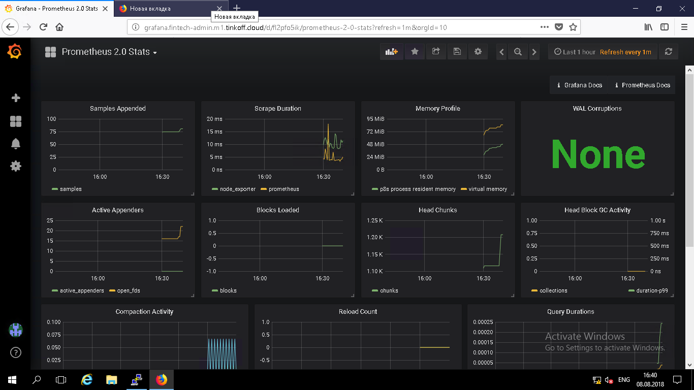
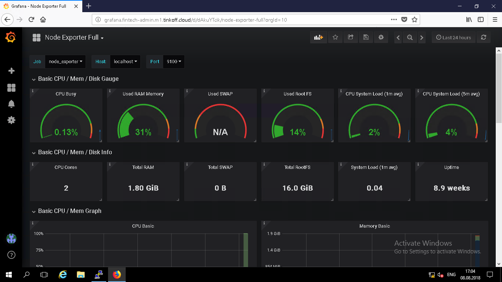
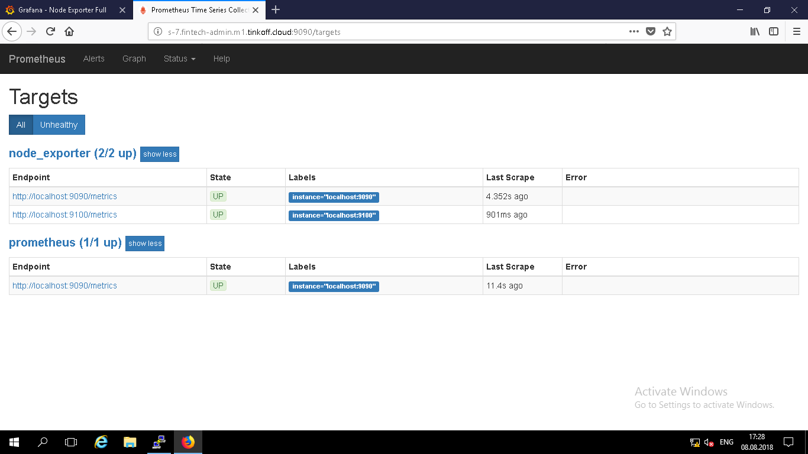

# Admins: HW → MRP

## Задание 1: Настройка Prometheus 

1. Для начала, скачиваем архивы и распаковывем их:
	```bash
	mkdir Downloads
	cd Downloads
	wget https://github.com/prometheus/prometheus/releases/download/v2.3.2/prometheus-2.3.2.linux-amd64.tar.gz
	wget https://github.com/prometheus/node_exporter/releases/download/v0.16.0/node_exporter-0.16.0.linux-amd64.tar.gz
	tar xvf prometheus-2.3.2.linux-amd64.tar.gz
	tar xvf node_exporter-0.16.0.linux-amd64.tar.gz
	```

2. Изменение конфигурации Prometheus:
	```bash
	cd prometheus-2.3.2.linux-amd64
	vim prometheus.yml
	```

	```yaml
	# my global config
	global:
	  scrape_interval:     15s # Set the scrape interval to every 15 seconds. Default is every 1 minute.
	  evaluation_interval: 15s # Evaluate rules every 15 seconds. The default is every 1 minute.
	  # scrape_timeout is set to the global default (10s).
	# Alertmanager configuration
	alerting:
	  alertmanagers:
	  - static_configs:
	    - targets:
	      # - alertmanager:9093
	# Load rules once and periodically evaluate them according to the global 'evaluation_interval'.
	rule_files:
	  # - "first_rules.yml"
	  # - "second_rules.yml"
	# A scrape configuration containing exactly one endpoint to scrape:
	# Here it's Prometheus itself.
	scrape_configs:
	  # The job name is added as a label `job=<job_name>` to any timeseries scraped from this config.
	  - job_name: 'prometheus'
	    # metrics_path defaults to '/metrics'
	    # scheme defaults to 'http'.
	    static_configs:
	    - targets: ['localhost:9090']
	  - job_name: 'node_exporter'
	    static_configs:
	    - targets: ['localhost:9100','localhost:9090']
	```

3. Запуск Node_exporter:
	```bash
	cd ../node_exporter-0.16.0linux-amd64
	./node_exporter &
	cd ../prometheus-2.3.2.linux-amd64
	./prometheus
	```







## Задание 2: Запуск Prometheus и Node_exporter под Supervisord

1. Необходимо завершить работу Prometheus и Node Exporter
	```bash
	ps aux | grep prometheus
	kill <prometheus-id>
	ps aux | grep node_exporter
	kill <node_exporter-id>
	# Или вызвать netstat -natp и посмотреть какие приложения сидят на каких портах
	```

2. Для удобства запуска программ под Supervisord выполним команды
	```bash
	cd /root/Downloads/
	mv prometheus-2.3.2.linux-amd64 /opt/prometheus
	mv node_exporter-0.16.0.linux-amd64 /opt/node_exporter
	mkdir -p /var/log/prometheus /var/log/node_exporter
	```

3. Для работы Supervisord добавим в директорию /etc/supervisord.d/ файлы prometheus.ini и node_exporter.ini
	```
	[program:prometheus]
	command=/opt/prometheus/prometheus 
	stdout_logfile=/var/log/prometheus/prometheus.log
	stderr_logfile=/var/log/prometheus/errors.log
	autostart=true
	autorestart=true
	directory=/opt/prometheus/
	```

	```
	[program:node_exporter]
	command=/opt/node_exporter/node_exporter 
	stdout_logfile=/var/log/node_exporter/node_exporter.log
	stderr_logfile=/var/log/node_exporter/errors.log
	autostart=true
	autorestart=true
	```

4. Запускаем Supervisord и проверяем запущены ли программы
	```bash
	systemctl enable supervisord
	systemctl start supervisord
	systemctl status supervisord
	```

	Если Supervisord уже запущен и настроен на запуск при старте ОС, то достаточно выполнить команду:
	```bash
	supervisorctl update
	supervisorctl status
	```

5. От себя:
	Ниже в файле уже поправил, но столкнулся с тем, что prometheus не мог запуститься под supervisord. Просмотрев логи, понял: проблема была в том, что prometheus не мог найти файл конфигурации promehteus.yml. Причина: программа запускалась не из дериктории /opt/prometheus. Для этого добавил в ini директиву _directory_. После выполнил `supervisorctl update` чтобы supervisord подхватил настройки заново.  

## Задание 3: Изменение метода отправки
1.	Для начала скачиваем и разархивируем uwsgi_exporter
	```bash
	wget https://github.com/timonwong/uwsgi_exporter/releases/download/v0.7.0/uwsgi_exporter-0.7.0.linux-amd64.tar.gz
	tar xvf uwsgi_exporter-0.7.0.linux-amd64.tar.gz
	mv uwsgi_exporter-0.7.0.linux-amd64 /opt/uwsgi_exporter
	mkdir -p /var/log/uwsgi_exporter
	```

2. Правим /etc/supervisord.d/former.ini
	Таким образом команда запуска будет выглядеть следующим образом:
	```
	command=uwsgi
    	--plugins=python
    	--http-socket=0.0.0.0:80
    	--wsgi-file /opt/webcode/former/process/webrunner.py
    	--static-map /form=/opt/webcode/former/form/index.html
    	--processes=5
    	--master
    	--pidfile=/tmp/former.pid
    	--vacuum
    	--max-requests=5000
    	--stats "127.0.0.1:1717"
    	--stats-http
    ```

3. Также оборачиваем uwsgi_exporter в Supervisord
	```
	[program:uwsgi_exporter]
	command=/opt/uwsgi_exporter/uwsgi_exporter
		--stats.uri="http://127.0.0.1:1717" 
	stdout_logfile=/var/log/uwsgi_exporter/uwsgi_exporter.log
	stderr_logfile=/var/log/uwsgi_exporter/errors.log
	autostart=true
	autorestart=true
	``` 

4. Делаем изменения в prometheus.yml
	Добавляем в scrape_configs еще один job:
	```yaml
	...
	scrape_configs:
	  ...
	  - job_name: 'uwsgi_exporter'
	    static_configs:
	    - targets: ['localhost:9117']
	...
	```

5. Обновляем настройки Supervisord и проверяем 
	```bash
	supervisorctl update
	supervisorctl status
	```
